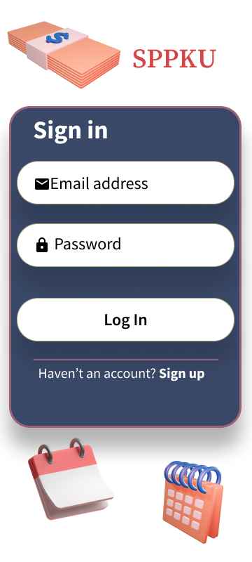
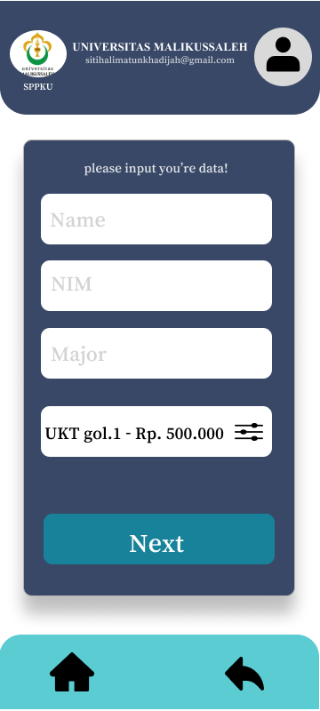
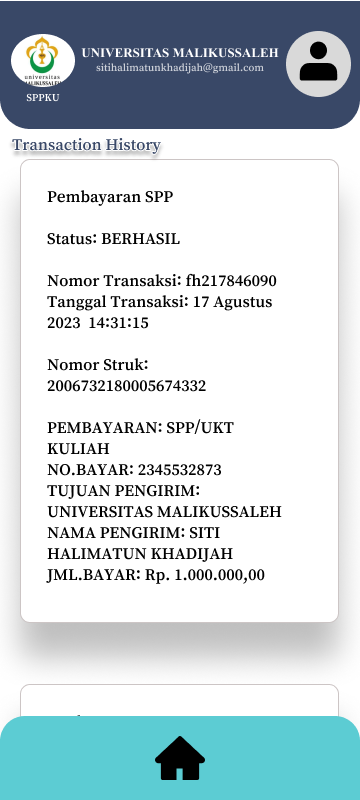
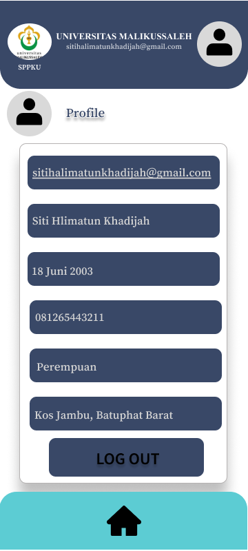

# UI/UX Design — University UKT Payment App (SPPKU)

Designed a mobile payment app that simplifies tuition fee (UKT) 
payments for university students. The flow covers sign up, fee 
category selection, virtual account payment via bank transfer, 
and transaction history.

## Key Screens
- Sign Up & Login
- UKT Category Selection
- Payment Method (Virtual Account — BSI)
- Transaction Receipt & History
- User Profile

## Tools
- Figma

## Design Preview
[View Full Design on Figma](https://www.figma.com/design/AMMHRpiyA7dArHlCUfz3k1/UKT-APP-Mobile?node-id=0-1&t=U6LkA9wpgv20RlXg-1)

## Screenshots

